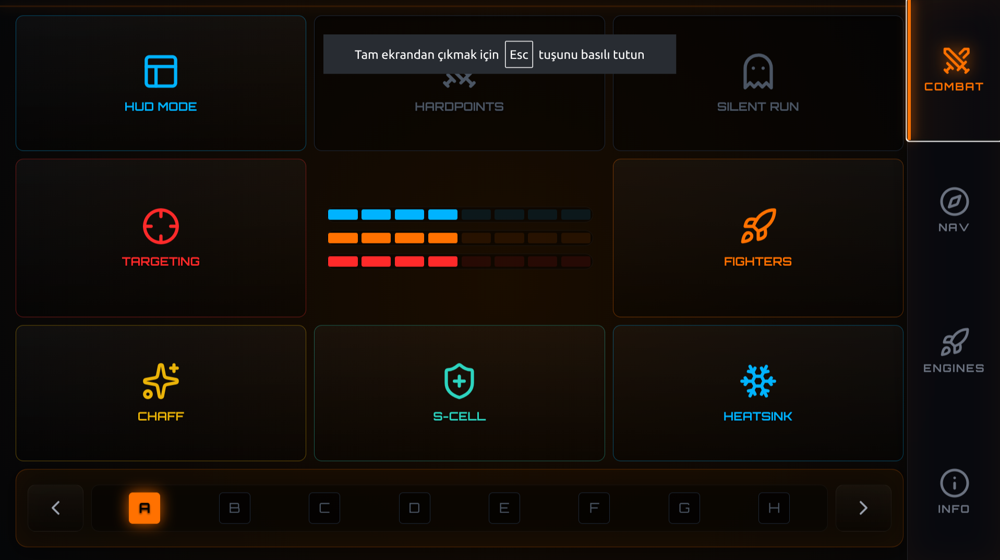
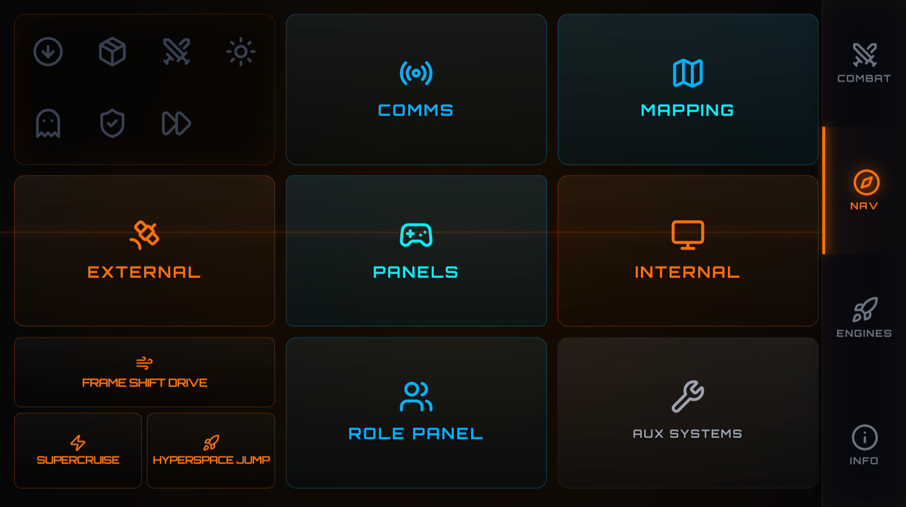
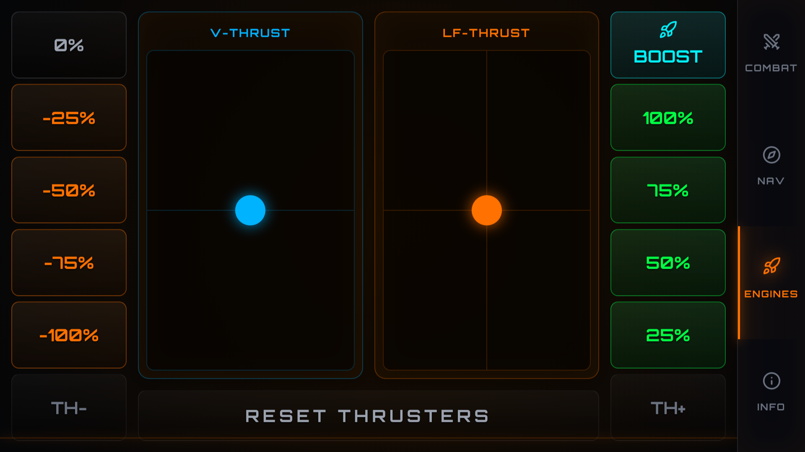
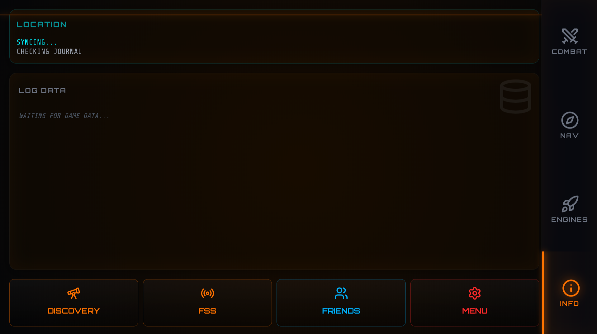
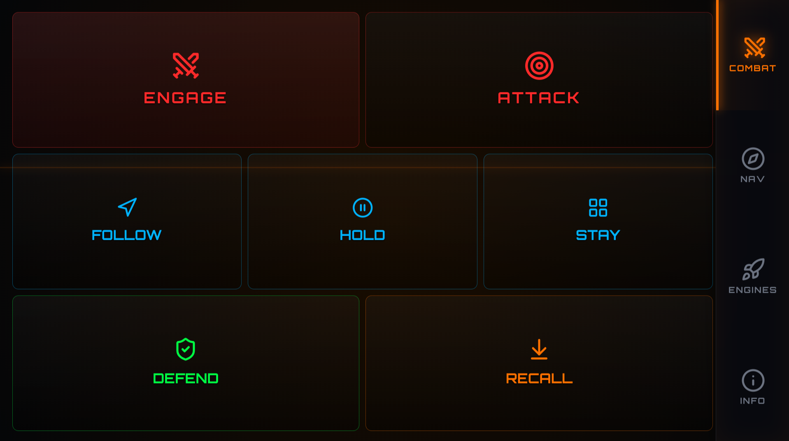
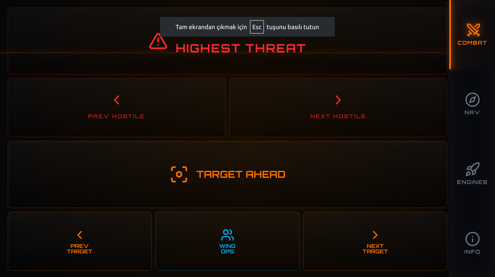
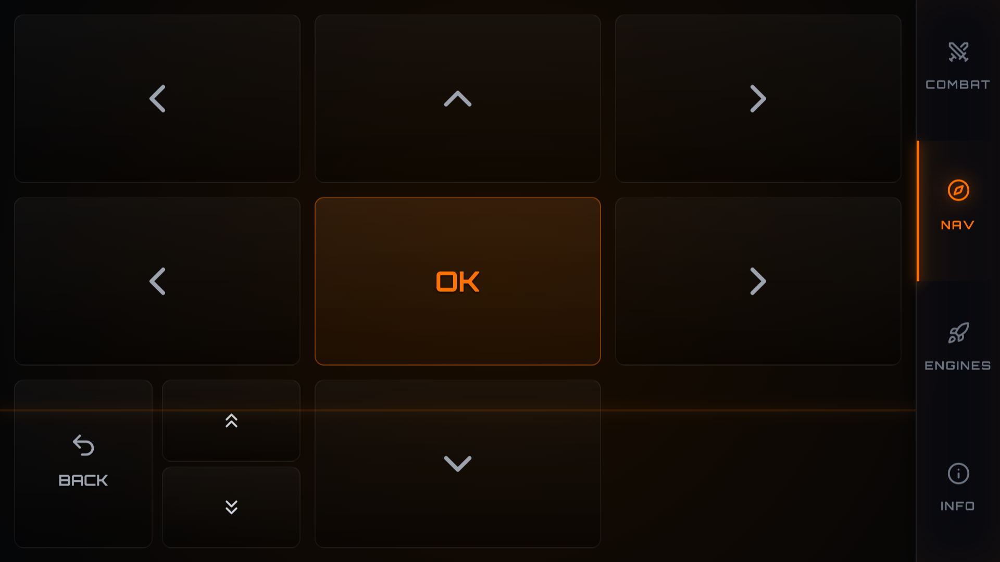
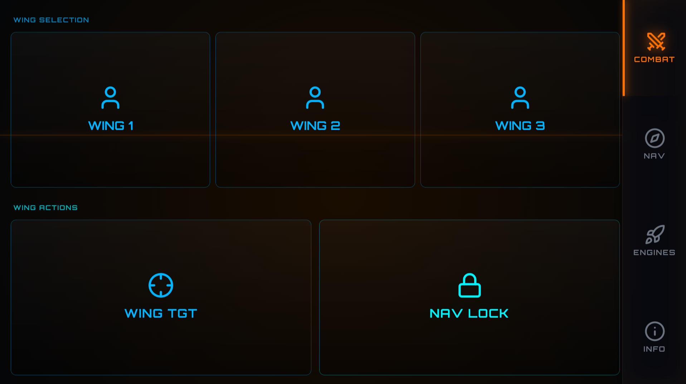

# E:D - NAV-COM

A high-performance, Linux-native network controller designed specifically for **Elite Dangerous**. This application provides a responsive, immersive Elite Dangerous-themed interface to control your ship's systems and monitor live telemetry directly from your smartphone or tablet.

## 📸 Screenshots

| Combat Interface | Navigation Panel |
| :---: | :---: |
|  |  |

| Engines & Thrusters | Information Display |
| :---: | :---: |
|  |  |

| Fighters Control | Targeting System |
| :---: | :---: |
|  |  |

| Sub-Panels | Wing Operations |
| :---: | :---: |
|  |  |

## 🚀 Features

* **Full-Scale Responsive Design:** Optimized UI that dynamically scales to fill any screen size and aspect ratio without scrolling.
* **Touch-Optimized Layouts:** Large, glass-morphism style buttons designed for reliable interaction on smartphones and tablets.
* **Linux Native:** Built for Linux using `evdev/uinput` for high-performance virtual joystick and keyboard emulation.
* **Dedicated Launcher:** Aesthetic Tkinter-based desktop launcher with real-time server logging.
* **Real-time Telemetry:** Direct integration with Elite Dangerous's `Status.json`.
* **Immersive Control Pages:**
    * **Silent Running Protocol:** Dedicated warning page with pulsing animations and thermal management alerts.
    * **Combat Controls:** Integrated 3x3 scaling grid for Targeting, Fighters, Heatsink, Chaff, and Shield Cells.
* **Live Cockpit Indicators:** Visual feedback for Shields, Hardpoints, Landing Gear, Cargo Scoop, Lights, and FSD.
* **Power Management:** Real-time PIPS (Power Distributor) status and active Fire Group tracking.
* **Navigation & Surface Data:** Destination info, credit balance, cargo capacity, and planetary coordinates.

## 🛠️ Requirements

* **OS:** Linux (X11 or Wayland supported).
* **Game:** Elite Dangerous (via Proton/Steam).
* **Permissions:** Access to `/dev/uinput` (see [Udev Configuration](#-udev-configuration)).

## 📦 Installation & Usage

1.  **Download** the `ED-NAV-COM` standalone binary from the releases page.
2.  **Make it executable:**
    ```bash
    chmod +x ED-NAV-COM
    ```
3.  **Install Shortcut (Optional):**
    Copy the provided `.desktop` file to `~/.local/share/applications/` to see the app in your system menu with its custom icon.

4.  **Run the App:**
    Launch `ED-NAV-COM` from your menu or terminal. The launcher will show your local IP address.

5.  **Connect:**
    Open your smartphone/tablet browser and navigate to the IP shown (e.g., `http://192.168.1.X:5000`).

## ⚙️ Udev Configuration

Since the app creates a virtual joystick, it requires permission to access `/dev/uinput`. To run without root, create a udev rule:

1. Create a file `/etc/udev/rules.d/99-uinput.rules`:
   ```bash
   KERNEL=="uinput", MODE="0660", GROUP="uinput", OPTIONS+="static_node=uinput"
   ```
2. Add your user to the `uinput` group:
   ```bash
   sudo groupadd uinput
   sudo usermod -aG uinput $USER
   ```
3. Restart your system or reload rules:
   ```bash
   sudo udevadm control --reload-rules && sudo udevadm trigger
   ```

## ⚠️ Important Notes

* **Focus:** The game must be the active window for virtual keyboard commands to be processed.
* **Network:** Both your PC and mobile device must be on the same local network.
* **Safety:** This is a local network tool. Do not expose port 5000 to the public internet.

---
*Fly Dangerously, Commander! o7*
