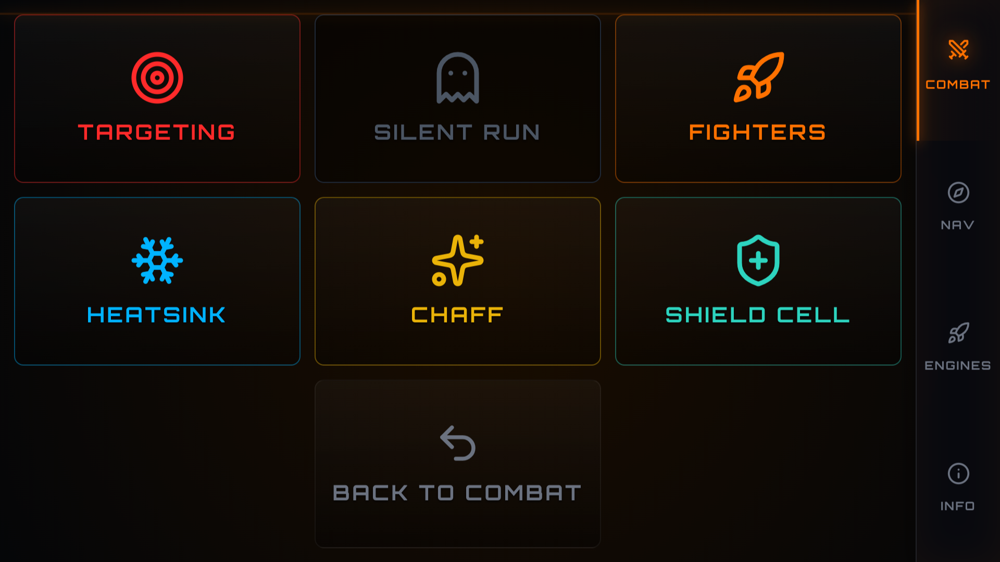

# Network Controller for Elite Dangerous

A lightweight Python-based local network controller designed specifically for **Elite Dangerous**. This script hosts a responsive, Elite Dangerous-themed web interface on your local network, allowing you to control your ship's systems and monitor live telemetry directly from your smartphone, tablet, or another monitor.

## 📸 Screenshots

| Combat Interface | Navigation Panel |
| :---: | :---: |
|  |  |

| Engines & Thrusters | Information Display |
| :---: | :---: |
|  |  |

| Utilities | External Panels |
| :---: | :---: |
|  |  |

## 🚀 Features

* **Real-time Telemetry:** Reads data directly from Elite Dangerous's `Status.json` file.
* **Live Cockpit Indicators:** Visual feedback for Shields, Hardpoints, Landing Gear, Cargo Scoop, Lights, Night Vision, Silent Running, and FSD.
* **Dynamic Information Displays:** Real-time updates for:
    * Fuel (Main Tank)
    * Power Distributor (PIPS) status with graphical bars
    * Active Fire Group (A-H)
    * Credit Balance
    * Cargo Capacity
    * Navigation Data (Destination, Body Focus, GUI Focus)
    * Planetary Surface Data (Latitude, Longitude, Altitude, Heading)
* **Direct Control:** Send keystrokes and vJoy inputs to your PC directly from the web interface.
* **Elite Dangerous Theme:** A custom dark and orange UI matching the in-game HUD.
* **System Clock:** Integrated local time display.

## 🛠️ Requirements

* **OS:** Windows 10/11.
* **Python:** 3.8 or higher.
* **Game:** Elite Dangerous (Odyssey or Horizons).
* **vJoy (Optional):** Required if you want to use axis controls (e.g., thrusters).

## 📦 Installation

1.  **Clone or download** this repository.
2.  **Install dependencies:**
    ```bash
    pip install -r requirements.txt
    ```

## 🎮 How to Use

1.  **Run the script:**
    ```bash
    python elite-control.py
    ```

### Connect via Browser

* **Local:** Go to `http://localhost:5000`.
* **Mobile/Remote:** Find your PC's local IP (e.g., `192.168.1.X`) and enter `http://192.168.1.X:5000`.

### ⚠️ Important for Controls

- **Focus:** Elite Dangerous must be the active/focused window for keyboard commands to work.
- **vJoy:** If using vJoy, ensure Device 1 is available and configured.

## ⌨️ Default Keybindings

Ensure your in-game settings match these keys (or edit the `KOMUTLAR` dictionary in the script):

| Action | Key | Action | Key |
| :--- | :--- | :--- | :--- |
| Hardpoints | `U` | Heatsink | `V` |
| Landing Gear | `L` | Chaff | `C` |
| Cargo Scoop | `Home` | Shield Cell | `B` |
| Lights | `Insert` | Galaxy Map | `M` |
| Night Vision | `N` | System Map | `O` |
| Silent Running | `Delete` | FSS Mode | `'` |
| FSD / SC | `J` | HUD Mode | `\` |
| PIPS Control | `Arrows` | Fire Groups | `[` and `]` |
| Menu | `ESC` | | |

## ⚠️ Important Notes

* **Status.json Location:** The script automatically searches in `~\Saved Games\Frontier Developments\Elite Dangerous\`.
* **Network:** Both your PC and mobile device must be on the same local network (Wi-Fi).
* **Safety:** This is a development server for personal local use. Do not expose port 5000 to the public internet.

---
*Fly Dangerously, Commander! o7*
